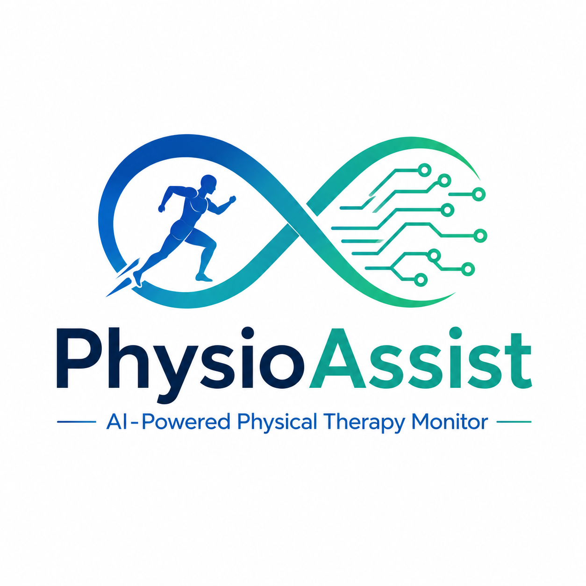

  

<h1 align="center">🏥 PhysioAssist</h1>

<h3 align="center">
AI-Powered Physical Therapy Monitor
</h3>

Empowering physiotherapy with AI-driven posture analysis and real-time corrective feedback.

---

## 📑 Table of Contents

- [About](#-about)
- [Features](#-features)
- [Tech Stack](#-tech-stack)
- [System Architecture](#-system-architecture)
- [Project Structure](#-project-structure)
- [Installation](#-installation)
- [Screenshots](#-screenshots)
- [Future Enhancements](#-future-enhancements)
- [Author](#-author)

# 🏥 PhysioAssist – AI-Powered Physical Therapy Monitor

### Empowering physiotherapy with AI-driven posture analysis and real-time corrective feedback.

---

## 📖 About

PhysioAssist is an AI-powered web application that helps users perform physiotherapy exercises correctly using real-time pose estimation. The system tracks body posture through a webcam, calculates joint angles, detects incorrect posture, and provides instant corrective feedback to improve rehabilitation outcomes.

It also provides secure authentication, progress tracking, exercise history, and performance analytics, making physiotherapy more accessible and effective.

---

## ✨ Features

- 🧍 Real-Time Pose Detection
- 📐 Joint Angle Calculation
- 🤖 AI-Based Feedback
- 📊 Performance Dashboard
- 🔐 Firebase Authentication
- ☁️ MongoDB Atlas Integration
- 📱 Responsive User Interface
- 📈 Exercise Progress Tracking
